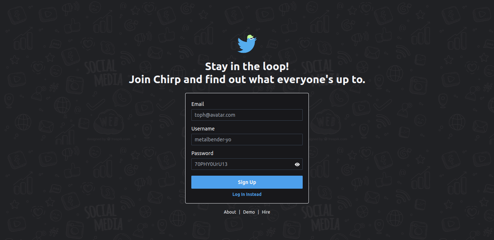

## Intro

Chirp is a Twitter clone in its very early stages. So far, the only thing working is authentication and that too has a few
rough edges.

## Build and Run

You can run Chirp locally if you are willing to go through some initial setup steps.

### Database Configuration

1. Install MySQL >= 8.0.3x.
2. Create a new database called `twitter_clone`.
3. Execute the `schema.sql` script in MySQL console in order to generate the required table schema. 
4. Edit `application.properties` and set the database credentials.

### Application Configuration

In addition to MySQL specific properties in `application.properties`, one needs to set up the mail server and the JWT
secret.

An email server is required for sending real emails to users to verify their email as they Sign Up or when they issue
a password change request. The mail server requires these properties:

```properties
spring.mail.host=<host>
spring.mail.port=<port>
spring.mail.username=<username>
spring.mail.password=<password>

# Set this to false if no authentication is required.
spring.mail.properties.mail.smtp.auth=true
# Set this to false if not using TLS.
spring.mail.properties.mail.smtp.starttls.enable=true
```

We are using JWT tokens for authentication. You must configure a JWT secret by setting this property: 

```properties
security.jwt.secret=<your-mother's-maiden-name>
```

## Run

The `client` directory contains source for the front-end. The client-side is React based. In order to run the application,
both, the React front-end as well as Spring Boot back-end needs to run in parallel. Furthermore, they must serve specifically
on the following URLs:

    Front-end: http://localhost:3000
    Back-end: http://localhost:8080

These are default for React and Spring Boot, respectively. If there's a port-conflict in your machine and either `3000`
or `8080` isn't available, the application won't function properly (although you can still get it to boot).

**Fire up the back-end:**

```shell
cd Chirp
mvn spring-boot:run
```

**Fire up the front-end:**

```shell
cd Chirp/client
npm start
```

If the stars align just right for you, the following page should pop open in your browser.

Check out that cool logo!


